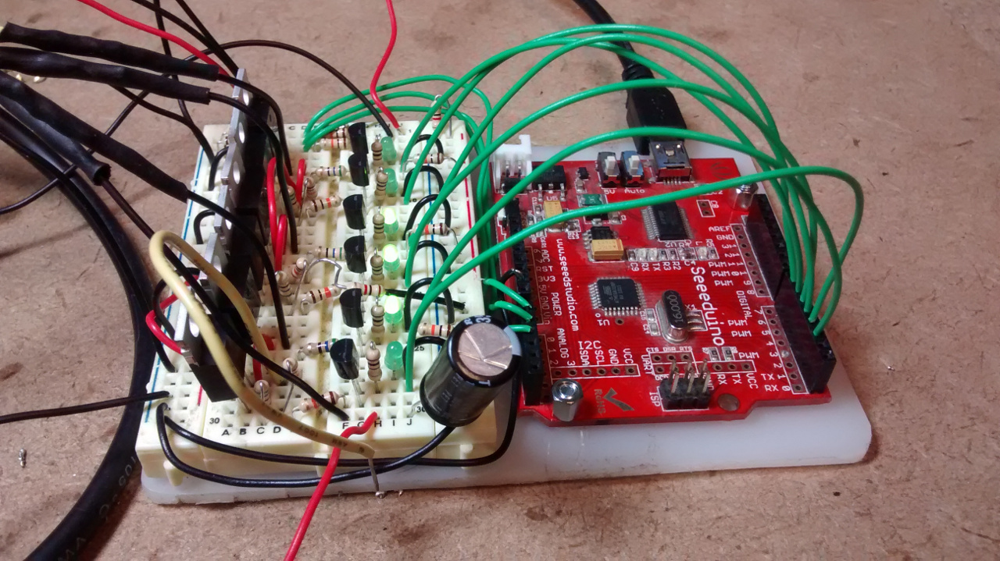
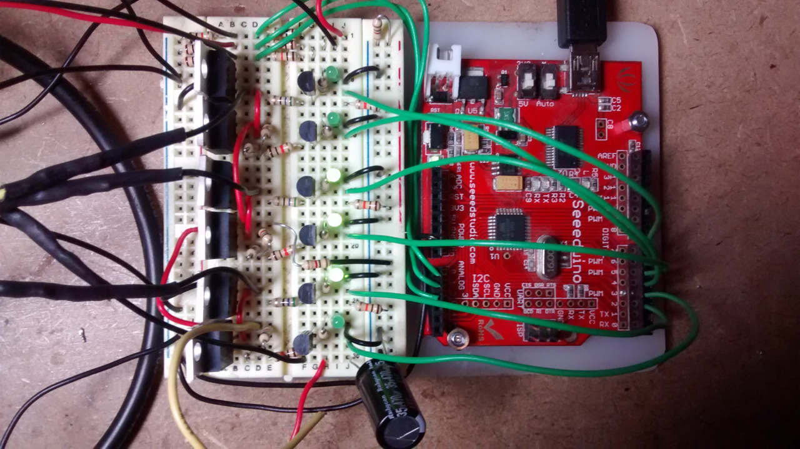
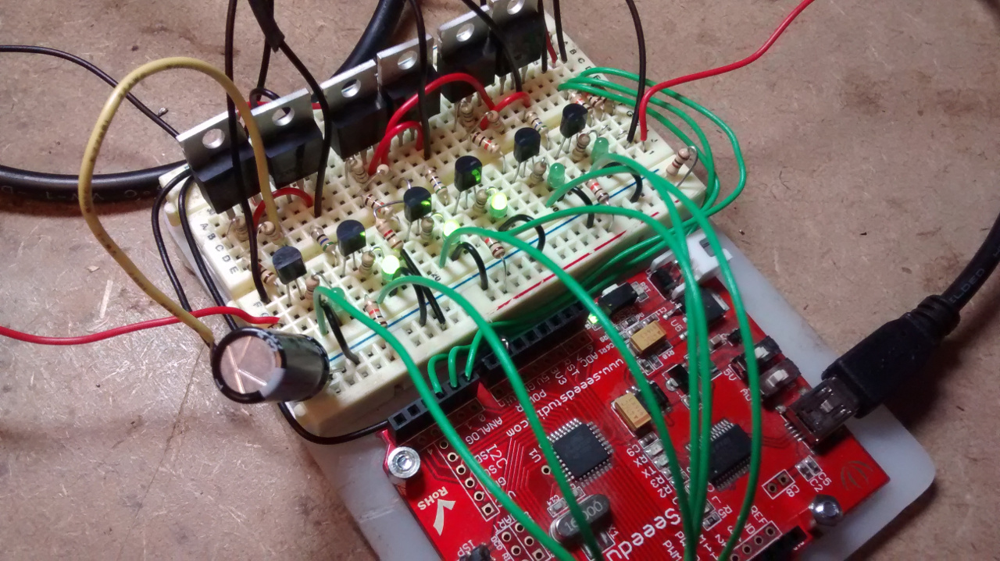

# BLDC Controller

This github repository documents learning about 3 phase sensored brushless DC motor control with the eventual aim of building an ebike controller

Video demo of basic arduino BLDC controller: [https://youtu.be/3LG14Kc8SRs](https://youtu.be/3LG14Kc8SRs)

### 1) Useful resources for getting started

- [Video by digitalPimple: Brushless DC Motors & Control - How it Works (Part 1 of 2)](https://www.youtube.com/watch?v=ZAY5JInyHXY)
- [Application note: AN857 Brushless DC Motor Control Made Easy - good explanation of sensored commutation](http://ww1.microchip.com/downloads/en/AppNotes/00857B.pdf) 

Makeatronics open source BLDC Motor controller explanation and design:

- [Makeatronics: BLDC Motor Control](http://makeatronics.blogspot.co.uk/2014/05/bldc-motor-control.html)
- [Makeatronics: Smart BLDC Commutator - Hardware](http://makeatronics.blogspot.co.uk/2014/08/smart-bldc-commutator-hardware.html)
- [Github: Smart-BLDC-Commutator-Hardware](https://github.com/fugalster/Smart-BLDC-Commutator-Hardware)
- [Github: Smart-BLDC-Commutator (Arduino firmware)](https://github.com/fugalster/Smart-BLDC-Commutator)

### 2) First prototype design based on Makeatronics schematic

First prototype based on Nich Fugal's (Makeatronics) schematic:

Using the following P-type Mosfet on the high sides, N-type Mosfets on the low sides and smaller N-type mosfets as gate drivers.

- [3x Low side Mosfets: IRF1404ZPBF TO-220](http://uk.farnell.com/webapp/wcs/stores/servlet/ProductDisplay?partNumber=8657394) 
- [3x High side Mosfets:  IRF4905PBF TO-220](http://uk.farnell.com/webapp/wcs/stores/servlet/ProductDisplay?partNumber=8648190) 
- [6x Gate driver Mosfets: BS270](http://uk.farnell.com/webapp/wcs/stores/servlet/ProductDisplay?partNumber=1017689)

The sensored brushless DC motor used was a 24V 134W motor (code: 57ZW3Y74A40) courtesy of [Ken Boak](http://sustburbia.blogspot.co.uk).

### 3) Basic Arduino Commutation firmware

The source code below is all that is needed to cover basic commutation without speed control. Using low level digital input reads and writes that allow reading and writing from/to a full port in one operation ensures that the commutation switch over is as fast and precise as possible rather than introducing delays due to sequential digital pin reading and writing.

In each loop the program reads from the what are usually the analog inputs but here read as digital inputs (PINC) and then writes to digital outputs 2-7 (PORTD) the control signals requires for the commutation position.

The signals for the low side mosfets are INVERTED so that a 0 results in a conducting mosfet tying the motor phase to ground and 1 results in a non-conducting mosfet.

Basic hall sensor reader and commutation driver:

    #define DEBUG 0

    void setup() {
      Serial.begin(115200);
      // Set digital pins 2 to 7 as outputs (right to left)
      // Digital Pin: 7,6,5,4,3,2,1,0
      DDRD = DDRD | B11111100;
    }

    void loop() {
     
      byte b = PINC;
      if (b==0b000001) {
        if (DEBUG) Serial.println("p100");
        //           CcBbAa
        // PORTD = 0b01001000; (non inverted low side reference)
           PORTD = 0b00011100; // inverted low-side
      }
      if (b==0b000011) {
        if (DEBUG) Serial.println("p110");
        //           CcBbAa
        // PORTD = 0b01100000; (non inverted low side reference)
           PORTD = 0b00110100;
      }
      if (b==0b000010) {
        if (DEBUG) Serial.println("p010");
        //           CcBbAa
        // PORTD = 0b00100100; (non inverted low side reference)
           PORTD = 0b01110000;
      }
      if (b==0b000110) {
        if (DEBUG) Serial.println("p011");
        //           CcBbAa
        // PORTD = 0b10000100; (non inverted low side reference)
           PORTD = 0b11010000;
      }
      if (b==0b000100) {
        if (DEBUG) Serial.println("p001");
        //           CcBbAa
        // PORTD = 0b10010000; (non inverted low side reference)
           PORTD = 0b11000100;
      }
      if (b==0b000101) {
        if (DEBUG) Serial.println("p101");
        //           CcBbAa
        // PORTD = 0b00011000; (non inverted low side reference)
           PORTD = 0b01001100;
      }
    }

A more condenced version of the above would look like this, providing basic commutation in 13 lines of code:

    void setup() {
      DDRD = DDRD | B11111100;
    }

    void loop() {
      byte b = PINC;
      if (b==0b000001) PORTD = 0b00011100;
      if (b==0b000011) PORTD = 0b00110100;
      if (b==0b000010) PORTD = 0b01110000;
      if (b==0b000110) PORTD = 0b11010000;
      if (b==0b000100) PORTD = 0b11000100;
      if (b==0b000101) PORTD = 0b01001100;
    }

### Reference pictures

